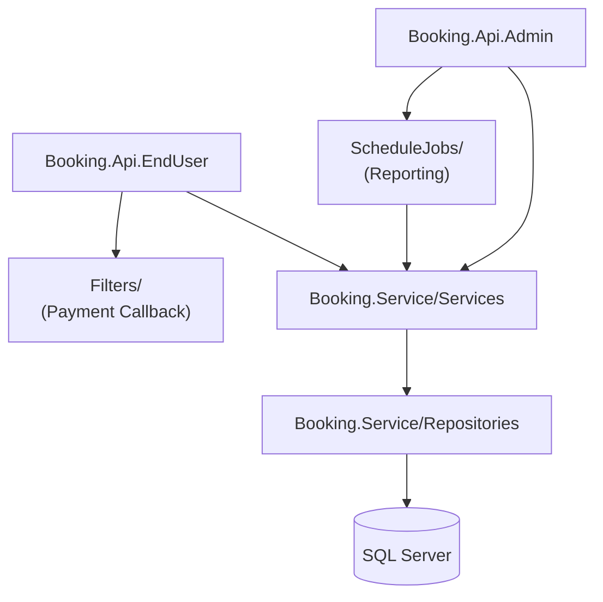

# SA-001: System Overview — booking-backend

> Copy this template and assign a sequential number, e.g., `SA-001_system-architecture.md`.
> Naming regex: `^SA-\d{3}_[a-z0-9-]+\.md$`

| Field         | Value      |
| ------------- | ---------- |
| Version       | v0.1       |
| Snapshot Date | 2026-04-24 |
| Status        | Active     |

## System Overview

booking-backend is a large-scale event booking system that provides two independent REST API hosts sharing a common service layer. The Admin API handles operations such as venue planning, seat layout, reporting, and scheduled jobs. The EndUser API serves public-facing features including seat selection, payment, and booking status. Both hosts share `Booking.Service` and `Booking.Service/Repositories`, with no duplicated business logic.

## Tech Stack

| Item       | Version / Description                         |
| ---------- | --------------------------------------------- |
| Language   | C# (.NET 10)                                  |
| Framework  | ASP.NET Core 10, EF Core 10                   |
| Test       | MSTest                                        |
| Database   | SQL Server (EF Core Code-First migrations)    |
| Deployment | Azure Web App (CI via GitHub Actions)         |
| SDK Source | `global.json`; package versions per `.csproj` |

## Architecture Pattern

**Dual-Host Shared Service Layer**

```
Booking.Api.Admin    Booking.Api.EndUser
        │                     │
        └──────────┬───────────┘
                   │
          Booking.Service
          ├── Services/        (business logic)
          └── Repositories/    (data access, EF Core)
                   │
             SQL Server
```

- Controllers in each host handle HTTP only and delegate to `Booking.Service/Services`.
- All database operations go through `Booking.Service/Repositories` — no direct DbContext in Controllers.
- Auth chain: JWT validation → `AuthMiddleware` → `[Authorize]` policy → Controller.

## Module Relationship Diagram



## Core Modules

| Module                            | Responsibility                               | Key Classes/Files                        |
| --------------------------------- | -------------------------------------------- | ---------------------------------------- |
| `Booking.Api.Admin/Controllers`   | HTTP entry for admin operations              | `VenueController`, `ReportController`    |
| `Booking.Api.EndUser/Controllers` | HTTP entry for public users                  | `BookingController`, `PaymentController` |
| `Booking.Api.*/Middleware`        | JWT validation, auth chain                   | `AuthMiddleware`, `JwtTokenHandler`      |
| `Booking.Service/Services`        | Business logic (booking, payment, reporting) | `BookingService`, `PaymentService`       |
| `Booking.Service/Repositories`    | EF Core data access                          | `BookingRepository`, `VenueRepository`   |
| `ScheduleJobs/`                   | Background jobs (report generation, cleanup) | `ReportGenerationJob`                    |
| `Filters/`                        | Payment gateway callback handling            | `PaymentCallbackFilter`                  |

## External Integrations

| External System  | Integration Method | Notes                                       |
| ---------------- | ------------------ | ------------------------------------------- |
| Payment Gateway  | HTTP callback      | Handled via `Filters/PaymentCallbackFilter` |
| Azure Blob/Email | REST (SDK)         | Used by `ScheduleJobs/` for report delivery |

## Known Risks & Tech Debt

- `[needs review]` No request-level idempotency guard on payment callback endpoint — duplicate delivery could cause double-processing.
- `[needs review]` `ScheduleJobs/` error handling is basic; failed jobs are logged but not retried automatically.

## Related Documents

- [`AGENTS.md`](../../AGENTS.md)
- [`docs/spec/SPEC-001_api-auth-and-rbac.md`](../spec/SPEC-001_api-auth-and-rbac.md)
- [`docs/adr/ADR-001_dual-host-api-architecture.md`](../adr/ADR-001_dual-host-api-architecture.md)
