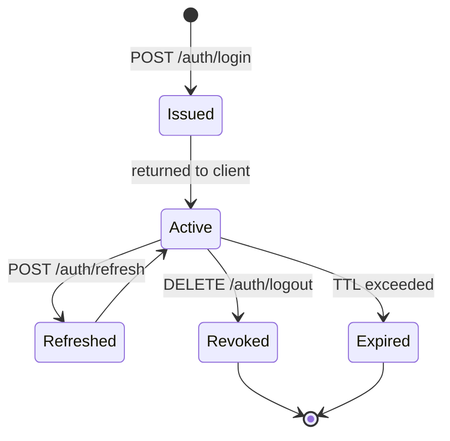

# SPEC-001: API Auth and RBAC

> Copy this template and assign a sequential number, e.g., `SPEC-001_auth-and-rbac.md`.
> Naming regex: `^SPEC-\d{3}_[a-z0-9-]+\.md$`

| Field   | Value                                                                   |
| ------- | ----------------------------------------------------------------------- |
| Version | v0.1                                                                    |
| Status  | Active                                                                  |
| Scope   | `AuthController` (Admin + EndUser), `AuthMiddleware`, `JwtTokenHandler` |
| Related | SA-001_system-overview.md, ADR-001_dual-host-api-architecture.md        |

## Overview

Handles user authentication (login / token refresh / logout) and role-based access control (RBAC) for both the Admin and EndUser API hosts. All protected endpoints require a valid JWT. Admin endpoints additionally enforce role membership via `[Authorize(Roles = "...")]`.

## Interface Definitions

### `POST /api/v1/auth/login`

| Item     | Description                                                                   |
| -------- | ----------------------------------------------------------------------------- |
| Function | Authenticate user credentials; return access token + refresh token            |
| Auth     | None (public endpoint)                                                        |
| Request  | `LoginRequest` — `{ email: string, password: string }`                        |
| Response | `200 AuthTokenResponse` / `401 Unauthorized` / `422 ValidationProblemDetails` |

### `POST /api/v1/auth/refresh`

| Item     | Description                                                |
| -------- | ---------------------------------------------------------- |
| Function | Exchange a valid refresh token for a new access token pair |
| Auth     | None (refresh token passed in request body)                |
| Request  | `RefreshRequest` — `{ refreshToken: string }`              |
| Response | `200 AuthTokenResponse` / `401 Unauthorized`               |

### `DELETE /api/v1/auth/logout`

| Item     | Description                                                 |
| -------- | ----------------------------------------------------------- |
| Function | Revoke the current refresh token; invalidate active session |
| Auth     | Bearer JWT required                                         |
| Request  | `LogoutRequest` — `{ refreshToken: string }`                |
| Response | `204 No Content` / `401 Unauthorized`                       |

### `GET /api/v1/auth/me`

| Item     | Description                                    |
| -------- | ---------------------------------------------- |
| Function | Return current user profile and assigned roles |
| Auth     | Bearer JWT required                            |
| Request  | —                                              |
| Response | `200 UserProfileResponse` / `401 Unauthorized` |

## DTO Definitions

```csharp
// Request
record LoginRequest(string Email, string Password);
record RefreshRequest(string RefreshToken);
record LogoutRequest(string RefreshToken);

// Response
record AuthTokenResponse(
    string AccessToken,
    string RefreshToken,
    DateTimeOffset AccessTokenExpiresAt
);

record UserProfileResponse(
    Guid UserId,
    string Email,
    string DisplayName,
    IReadOnlyList<string> Roles
);
```

## State Machine

JWT lifecycle:



## Business Rules

1. Access token TTL: **15 minutes**. Refresh token TTL: **7 days**.
2. A refresh token can only be used once — rotation reissues a new pair.
3. On logout, the refresh token is added to a revocation list (checked on every `/refresh` call).
4. Admin API endpoints require `Role = "Admin"` or `Role = "Operator"` in addition to a valid JWT.
5. Passwords MUST be hashed with BCrypt (cost factor ≥ 12) — never stored in plaintext.

## Changelog

| Version | Date       | Changes                                                |
| ------- | ---------- | ------------------------------------------------------ |
| v0.1    | 2026-04-24 | Initial draft — login / refresh / logout (DELETE) / me |
