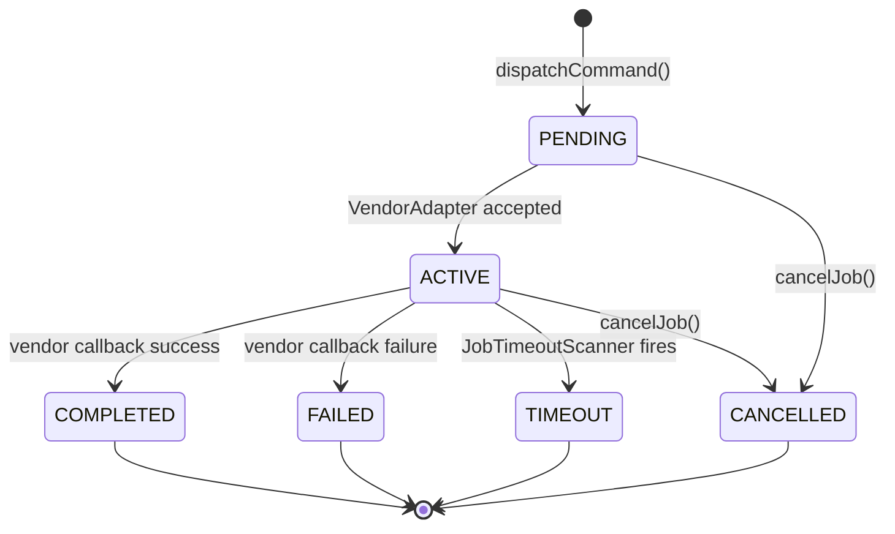

# SPEC-001: CommunicationCoreService Interface Contract

> Copy this template and assign a sequential number, e.g., `SPEC-001_auth-and-rbac.md`.
> Naming regex: `^SPEC-\d{3}_[a-z0-9-]+\.md$`

| Field   | Value                                                          |
| ------- | -------------------------------------------------------------- |
| Version | v0.1                                                           |
| Status  | Active                                                         |
| Scope   | `CommunicationCoreService` (sole public API of edge-comm-core) |
| Related | SA-001_communication-core-system-analysis.md                   |

## Overview

`CommunicationCoreService` is the **only public interface** of the edge-comm-core library. Consumer projects (`logistics-api-hub`) interact exclusively through this interface. All internal components — `CommandDispatcher`, `AdapterFactory`, `JobTimeoutScanner` — are not accessible to consumers.

> **Rule**: Any change to a method signature in this interface MUST update the Changelog in this SPEC within the same PR.

## Interface Definitions

> This SPEC uses Java method signatures. For non-HTTP libraries, interface definitions replace the HTTP endpoint table.

### `dispatchCommand`

```java
/**
 * Dispatch a command to a target device.
 * Creates a Job record and delegates to the appropriate VendorAdapter.
 *
 * @param request  Command payload and target device metadata
 * @return         JobInfo containing jobId and initial status
 * @throws VendorSyncException if the Adapter fails to accept the command (runtime exception)
 */
JobInfo dispatchCommand(DispatchCommandRequest request);
```

### `getJobStatus`

```java
/**
 * Retrieve the current status of a previously dispatched Job.
 *
 * @param jobId  UUID of the Job (returned by dispatchCommand)
 * @return       JobInfo with current status; empty Optional if not found
 */
Optional<JobInfo> getJobStatus(UUID jobId);
```

### `cancelJob`

```java
/**
 * Request cancellation of a pending or active Job.
 * Has no effect on Jobs that are already in a terminal state.
 *
 * @param jobId  UUID of the Job to cancel
 * @return       true if the cancellation was accepted; false if already terminal
 */
boolean cancelJob(UUID jobId);
```

### `registerCompletionHandler`

```java
/**
 * Register a callback to be invoked when a Job reaches a terminal state
 * (COMPLETED or FAILED). Only one handler per consumer is supported.
 *
 * @param handler  Implementation of JobCompletionHandler
 */
void registerCompletionHandler(JobCompletionHandler handler);
```

## DTO Definitions

```java
// Request
record DispatchCommandRequest(
    UUID deviceId,
    String commandType,       // e.g., "UPDATE_DISPLAY", "REBOOT"
    Map<String, Object> payload,
    int timeoutSeconds        // max wait before Job is marked TIMEOUT
) {}

// Response / Query
record JobInfo(
    UUID jobId,
    UUID deviceId,
    String commandType,
    JobStatus status,         // see State Machine below
    Instant createdAt,
    Instant updatedAt,
    @Nullable String failureReason
) {}
```

## State Machine

Job lifecycle managed internally by the library:



## Business Rules

1. `dispatchCommand` is the **only entry point** for creating a Job — consumers MUST NOT insert into the `jobs` table directly.
2. Retry logic is entirely internal to the library. Consumers do not control retry intervals or attempt counts.
3. `registerCompletionHandler` MUST be called during application startup before any commands are dispatched; late registration is not guaranteed to receive in-flight job events.
4. `VendorSyncException` is the only explicit domain exception propagated to the consumer (as a runtime exception) — all other internal exceptions are wrapped or swallowed by the library.

## Changelog

| Version | Date       | Changes                                                                                |
| ------- | ---------- | -------------------------------------------------------------------------------------- |
| v0.1    | 2026-04-24 | Initial draft — dispatchCommand / getJobStatus / cancelJob / registerCompletionHandler |
