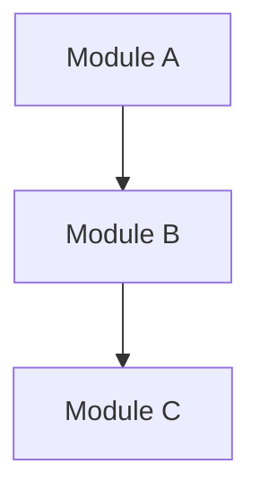

# ZeroSpec — SA Prompt Pack

> 當需要 **系統全貌快照** 時使用。將以下 Prompt 貼入 AI Agent，自動產生 System Analysis 文件。

---

## 觸發條件

- 專案進入新的里程碑階段
- 架構或核心依賴發生重大變更
- 新成員連續多次詢問同類架構問題
- 需要產出系統整體入門文件

---

## 使用方式

1. 確認觸發條件已滿足
2. 複製下方 Prompt 貼入 Agent
3. Agent 產出 SA 草稿後，審核內容並存檔至 `docs/analysis/`

---

````
---BEGIN PROMPT---

請為這個專案產生一份系統分析文件（System Analysis），作為里程碑式的系統快照。

## 前置條件

- `AGENTS.md` 已存在（若無，先用 INIT-SCAN + INIT-BUILD 建立）
- `docs/README.md` 已存在（若無，請先使用 INIT-BUILD 建立）

## 執行步驟

1. **讀取 AGENTS.md**：了解專案定位、技術棧、架構模式
2. **讀取 docs/README.md**：確認命名正規式與 SA 編號順序
3. **掃描專案頂層結構與核心模組（避免無限制遍歷所有小檔）**：
   - 列出所有主要模組/套件及其職責
   - 識別核心依賴與外部整合
   - 產生模組關係圖（Mermaid 格式）
4. **讀取既有 SPEC 與 ADR**：整合已記錄的介面契約與決策脈絡
5. **產出 SA 文件**，格式如下：

```markdown
# SA-xxx: {專案名稱} 系統架構分析

| 欄位     | 值         |
| -------- | ---------- |
| 版本     | v0.1       |
| 快照日期 | {今天日期} |
| 狀態     | Active     |

## 系統概述
（一段話描述系統定位與核心功能）

## 技術棧
（從 AGENTS.md 與設定檔萃取，保持 Major.Minor 精度）

## 架構模式
（描述分層策略、模組切分原則）

## 模組關係圖



## 核心模組清單
| 模組 | 職責 | 關鍵類別/檔案 |
| ---- | ---- | ------------- |
| ...  | ...  | ...           |

## 外部整合
| 外部系統 | 整合方式 | 備註 |
| -------- | -------- | ---- |
| ...      | ...      | ...  |

## 已知風險與技術債
（從程式碼品質與架構現況推斷，標註 [待審核]）

## 關聯文件
- AGENTS.md
- 既有 SPEC / ADR 列表
```

## 規則

- 命名格式：`SA-{三位數}_{小寫連字號描述}.md`
- SA 是快照性質：記錄「此刻的現況」，不預測未來
- 不列舉精確檔案數量，用結構模式描述
- 版本號只寫 Major.Minor
- 若無法從程式碼、設定檔或既有文件驗證，標註 `[待確認]`，不得猜測

## 產出後驗證

1. 檢查文件中引用的模組、類別名稱是否在程式碼中真實存在
2. 確認 Mermaid 圖中的模組關係與程式碼依賴一致
3. 確認 `docs/README.md` 的文件清單已包含新產出的 SA 文件

---END PROMPT---
````
