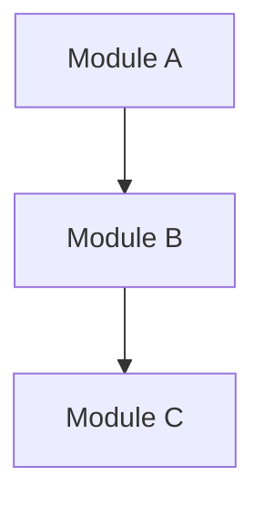

# ZeroSpec — SA Prompt Pack

> Use when a **system-wide snapshot** is needed. Paste the Prompt below into your AI Agent to generate a System Analysis document.

---

## Trigger Conditions

- Project enters a new milestone phase
- Major change in architecture or core dependencies
- New team members repeatedly asking the same architecture questions
- Need for a system-level onboarding document

---

## How to Use

1. Confirm a trigger condition is met
2. Copy the Prompt below and paste into the Agent
3. Review the SA draft and save to `docs/analysis/`

> **Multi-root Workspace Tip**
>
> When your workspace contains multiple projects, specify the target at the start to prevent the AI from modifying other projects:
>
> ```
> Target project: my-backend
> Generate a system analysis document.
> ```
>
> Or open any file within the target project (Active File anchoring) so the Agent prioritizes that project's context.
> If the target file path falls outside the target project scope, stop and report — do not write.
> See [DAILY-USAGE Section 2.4](../DAILY-USAGE.md#24-multi-root-workspace-notes).

---

````
---BEGIN PROMPT---

Generate a System Analysis document for this project as a milestone-level system snapshot.

> **Language**: Detect the repository's primary language from README, docs, and code comments. Respond in that language. Default to English if ambiguous.

## Prerequisites

- `AGENTS.md` exists (if not, run INIT-SCAN + INIT-BUILD first)
- `docs/README.md` exists (if not, run INIT-BUILD first)

## Steps

1. **Read AGENTS.md**: Understand project summary, tech stack, architecture pattern
2. **Read docs/README.md**: Confirm naming regex and SA numbering sequence
3. **Scan top-level project structure and core modules (DO NOT recursively traverse all small files)**:
   - List all major modules/packages and their responsibilities
   - Identify core dependencies and external integrations
   - Generate a module relationship diagram (Mermaid format)
4. **Read existing SPECs and ADRs**: Incorporate documented interface contracts and decision context
5. **Produce SA document** in the following format:

```markdown
# SA-xxx: {Project Name} System Architecture Analysis

| Field         | Value          |
| ------------- | -------------- |
| Version       | v0.1           |
| Snapshot Date | {today's date} |
| Status        | Active         |

## System Overview
(One paragraph describing the system's purpose and core capabilities)

## Tech Stack
(Extract from AGENTS.md and config files, maintain Major.Minor precision)

## Architecture Pattern
(Describe layering strategy, module separation principles)

## Module Relationship Diagram



## Core Modules
| Module | Responsibility | Key Classes/Files |
| ------ | -------------- | ----------------- |
| ...    | ...            | ...               |

## External Integrations
| External System | Integration Method | Notes |
| --------------- | ------------------ | ----- |
| ...             | ...                | ...   |

## Known Risks & Tech Debt
(Infer from code quality and architecture state, mark [needs review])

## Related Documents
- AGENTS.md
- Existing SPEC / ADR list
```

## Rules

- Naming format: `SA-{3-digit}_{lowercase-hyphenated-desc}.md`
- SA is a snapshot: record "the current state" — DO NOT predict the future
- DO NOT list exact file counts; describe structural patterns
- Write versions as Major.Minor only — omit Patch
- If unable to verify from code, config files, or existing docs, mark `[unverified]` — DO NOT guess

## Post-Output Verification

1. Verify that modules and class names referenced in the document actually exist in code
2. Confirm the Mermaid diagram's module relationships match code dependencies
3. Confirm `docs/README.md` document index includes the newly created SA

---END PROMPT---
````
