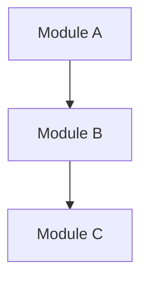

# SA-xxx: Title (Project Name + Analysis Topic)

> Copy this template and assign a sequential number, e.g., `SA-001_system-architecture.md`.
> Naming regex: `^SA-\d{3}_[a-z0-9-]+\.md$`

| Field         | Value      |
| ------------- | ---------- |
| Version       | v0.1       |
| Snapshot Date | YYYY-MM-DD |
| Status        | Active     |

## System Overview

One paragraph describing the system's purpose and core capabilities.

## Tech Stack

(Extract from AGENTS.md and config files, maintain Major.Minor precision)

| Item       | Version / Description |
| ---------- | --------------------- |
| Language   | ...                   |
| Framework  | ...                   |
| Build Tool | ...                   |
| Database   | ...                   |
| Deployment | ...                   |

## Architecture Pattern

Describe the layering strategy, module separation principles, and data flow.

## Module Relationship Diagram

## Core Modules

| Module | Responsibility | Key Classes/Files |
| ------ | -------------- | ----------------- |
| ...    | ...            | ...               |

## External Integrations

| External System | Integration Method | Notes |
| --------------- | ------------------ | ----- |
| ...             | REST / MQ          | ...   |

## Known Risks & Tech Debt

(Infer from code quality and architecture state, mark `[needs review]`)

- ...
- ...

## Related Documents

- `AGENTS.md`
- Existing SPEC / ADR list
