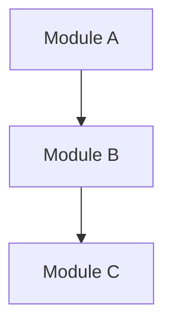

# SA-xxx: 標題（專案名稱 + 分析主題）

> 複製本模板並依序編號，例如 `SA-001_system-architecture.md`。
> 命名正規式：`^SA-\d{3}_[a-z0-9-]+\.md$`

| 欄位     | 值         |
| -------- | ---------- |
| 版本     | v0.1       |
| 快照日期 | YYYY-MM-DD |
| 狀態     | Active     |

## 系統概述

用一段話描述系統定位與核心功能。

## 技術棧

（從 AGENTS.md 與設定檔萃取，保持 Major.Minor 精度）

| 項目     | 版本 / 說明 |
| -------- | ----------- |
| 語言     | ...         |
| 框架     | ...         |
| 建置工具 | ...         |
| 資料庫   | ...         |
| 部署     | ...         |

## 架構模式

描述分層策略、模組切分原則、資料流向。

## 模組關係圖

## 核心模組清單

| 模組 | 職責 | 關鍵類別/檔案 |
| ---- | ---- | ------------- |
| ...  | ...  | ...           |

## 外部整合

| 外部系統 | 整合方式  | 備註 |
| -------- | --------- | ---- |
| ...      | REST / MQ | ...  |

## 已知風險與技術債

（從程式碼品質與架構現況推斷，標註 `[待審核]`）

- ...
- ...

## 關聯文件

- `AGENTS.md`
- 既有 SPEC / ADR 列表
