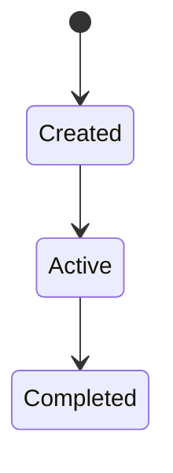

# SPEC-xxx: Title (Business Domain Name)

> Copy this template and assign a sequential number, e.g., `SPEC-001_auth-and-rbac.md`.
> Naming regex: `^SPEC-\d{3}_[a-z0-9-]+\.md$`

| Field   | Value                                         |
| ------- | --------------------------------------------- |
| Version | v0.1                                          |
| Status  | Draft / Active / Deprecated                   |
| Scope   | (Controllers / Services covered by this SPEC) |
| Related | SA-xxx, ADR-xxx                               |

## Overview

Describe the domain's business goal and API endpoint scope.

## Contract Ownership

- **Machine-verifiable contract**: {OpenAPI/schema/generated client/code path, or `not configured`}
- **This SPEC owns**: behavior, business rules, permissions, state transitions, compatibility, and consumer impact.
- Do not duplicate fields, types, or requiredness owned by the machine-verifiable contract.

## Interface Definitions

### `METHOD /api/v1/resource`

| Item       | Description                                       |
| ---------- | ------------------------------------------------- |
| Function   | ...                                               |
| Permission | `RESOURCE_READ` (use project's permission format) |
| Request    | ...                                               |
| Response   | ...                                               |

(List all API endpoints in this domain in sequence)

## DTO Definitions

| DTO Name | Purpose | Key Fields | Type | Notes |
| -------- | ------- | ---------- | ---- | ----- |
| ...      | ...     | ...        | ...  | ...   |

> Substitute with actual code examples per your tech stack (e.g., C# record, Java Record, TypeScript interface, Python dataclass).

## State Machine (Optional)

If this domain involves state transitions (e.g., Job status, order status), describe with a Mermaid diagram.

## Business Rules

List the key business rules and validation logic for this domain.

## Changelog

| Version | Date       | Changes       |
| ------- | ---------- | ------------- |
| v0.1    | YYYY-MM-DD | Initial draft |
